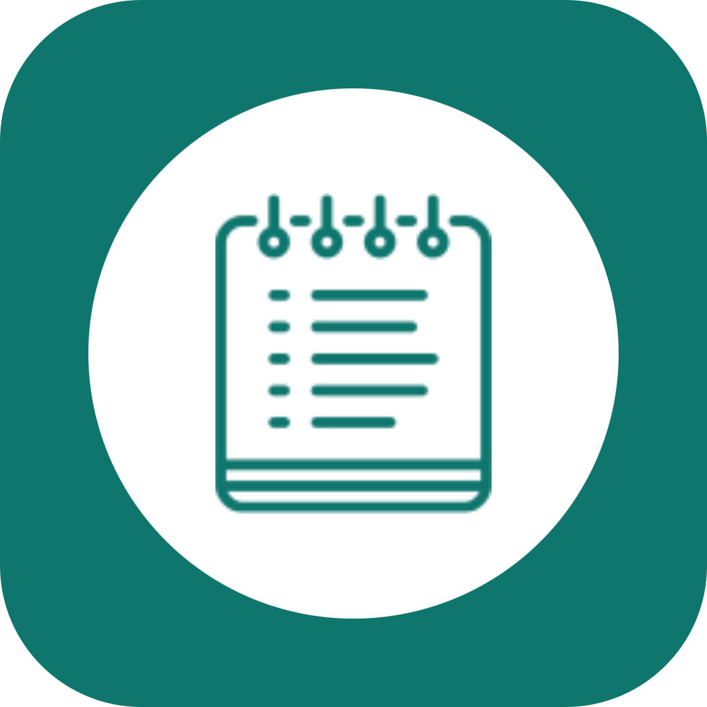
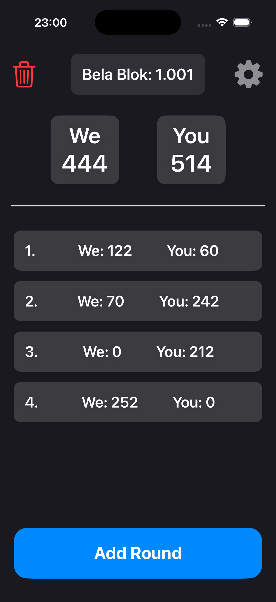

<h1 align="center">
  
  <br />
  Bela Blok
</h1>

<p align="center">
  A digital scorepad for Belot players — record, update, calculate, and track points the easy way.
</p>

---

## What is Bela Blok?

**Bela Blok replicates the traditional Belot scorepad digitally so players can focus on the game:**

- Record and update scores for multiple players across rounds
- Automatic point calculation — no manual math
- Clean, fast interface designed for use mid-game
- Keeps rounds organized and error-free
- Built for iOS with a native Swift interface

**`No paper needed. No miscalculations. Just track and play.`**

---

## How It Works

Getting started with Bela Blok is straightforward:

1. **Launch the app** — open in Xcode and run on simulator or device
2. **Enter player names** — set up your teams before the game starts
3. **Input round scores** — enter points after each hand
4. **Track totals automatically** — running totals update instantly
5. **Start a new game** — reset everything with one tap when the session ends

> [!TIP]
> Keep the app open on a shared device in the middle of the table so everyone can see the score at a glance.

---

## Installation

### Requirements

- Xcode 15 or later
- iOS 16.0+ target
- macOS with Xcode installed

### Steps
```bash
git clone https://github.com/Nmarino8/Bela-Blok.git
```

Navigate to the project folder:
```bash
cd "Bela Blok"
```

Open the Xcode project:
```bash
open "Bela Blok.xcodeproj"
```

Build and run using `Cmd+R` or the Run button in Xcode.

---

## Features

- **Multi-player Scoring** — record scores for all players or teams in one place
- **Automatic Calculation** — points are summed and updated after every round entry
- **Round Editing** — easily update or correct any round without starting over
- **Game History** — track the full progression of points from start to finish
- **Clean Interface** — minimal UI designed for quick use during an active game
- **New Game Reset** — start fresh instantly without leaving the app

---

## Screenshots

All screenshots showing the interface, score entry, settings, and game progress are available in the `screenshots/` folder of this repository.

<br>

<p align="center">
	
	
</p>
<p align="center">
	
	
</p>


---

## Data & Privacy

Bela Blok stores all game data locally on your device. No data is collected, transmitted, or shared with any external service.

> [!NOTE]
> This project is published primarily for viewing and learning purposes. The code demonstrates a practical iOS scorepad implementation using Swift.

> [!WARNING]
> You may not copy, modify, redistribute, or use this code to build derivative applications without explicit written permission from the author.

---

<h3 align="center">
  Bela Blok does not accept code contributions via pull requests.<br />
  Suggestions, ideas, and bug reports are welcome through GitHub Issues.
</h3>

---

<p align="center">
  © 2026 Niko Marinović. All rights reserved.
</p>
